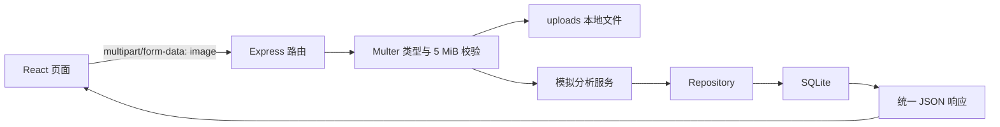
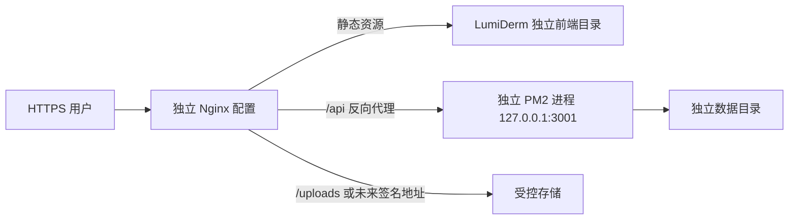

# 系统架构

## 前端架构

React 单页应用由 `App.jsx` 顺序组合页面模块，组件层与 `data/` 展示数据分离；`services/skinAnalysisApi.js` 是后端调用边界。Vite 提供开发服务和静态构建，Tailwind CSS 与项目样式文件共同承载视觉系统。

## 后端架构

Express 应用按 Route → Controller → Service / Repository → SQLite 分层。上传由 Multer 中间件处理，错误由统一中间件映射为 JSON；`server.js` 先初始化数据库，再监听端口。

## 数据流

## 图片上传流程

`POST /api/skin-analysis` 读取单个 `image` 字段，同时检查 MIME 类型、扩展名与 5 MiB 上限。通过后生成随机文件名并写入 `backend/uploads/`；该目录不进入版本控制。当前校验不是恶意内容检测，公网部署前仍需加强。

## 报告生成与保存

控制器根据上传文件信息调用模拟分析服务，生成 `analysisId`、总体分数、指标、面部分区、护理方向和免责声明。Repository 将结构化字段序列化为 JSON 并插入 `analysis_records`，随后把报告返回前端。

## SQLite 流程

首次调用数据库时创建 `backend/data/lumiderm.sqlite` 和 `analysis_records` 表及索引。列表查询按创建时间倒序并分页，详情以 `analysis_id` 查询。数据库文件属于本地状态，不提交 Git。

## 前后端接口关系

前端只直接调用创建分析接口；健康、列表与详情用于运行检查和未来历史中心。前端环境变量决定 API 根地址，后端 `FRONTEND_ORIGIN` 决定 CORS 来源。

## 本地运行架构

浏览器访问 `localhost:5173`，Vite 提供前端资源；浏览器直接请求 `localhost:3001` 的 Express API，后端使用本地 `uploads/` 与 SQLite。

## 未来腾讯云架构

该架构目前只是计划，没有已完成的云端验证结果。
